# Manual DSL R2Lang v1.0

## Índice
1. [Inicio Rápido](#inicio-rápido)
2. [¿Qué es un DSL?](#qué-es-un-dsl)
3. [Arquitectura del Sistema DSL](#arquitectura-del-sistema-dsl)
4. [Definición de Gramática](#definición-de-gramática)
5. [Tokens y Patrones](#tokens-y-patrones)
6. [Reglas de Producción](#reglas-de-producción)
7. [Acciones Semánticas](#acciones-semánticas)
8. [Ejemplos Completos](#ejemplos-completos)
9. [Casos de Uso Avanzados](#casos-de-uso-avanzados)
10. [Mejores Prácticas](#mejores-prácticas)
11. [Troubleshooting](#troubleshooting)

---

## Inicio Rápido

### ¿Ansioso por crear tu primer DSL? ¡Empecemos!

**Paso 1: Crear un DSL simple**
```r2
dsl MiPrimerDSL {
    // Definir tokens (palabras clave)
    token("SALUDO", "hola")
    token("NOMBRE", "[a-zA-Z]+")
    
    // Definir reglas (sintaxis)
    rule("mensaje", ["SALUDO", "NOMBRE"], "crear_saludo")
    
    // Definir acción (qué hacer)
    func crear_saludo(saludo, nombre) {
        return "¡" + saludo + " " + nombre + "!"
    }
}

func main() {
    // Usar el DSL
    var resultado = MiPrimerDSL.use("hola mundo")
    console.log(resultado)
}
```

**Paso 2: Ejecutar**
```bash
go run main.go examples/dsl/primer_dsl.r2
```

**Resultado esperado:**
```
=== Mi Primer DSL ===
Este DSL procesa saludos con sintaxis personalizada
Procesando: 'hola mundo'
Resultado DSL: &{{¡hola !} hola mundo {¡hola !}}
El DSL ha convertido 'hola mundo' en un saludo
✅ Primer DSL funcionando!
```

**Interpretación del resultado:**
- El DSL recibe `"hola mundo"` como entrada
- Lo procesa usando la gramática definida (tokens SALUDO y NOMBRE)
- Ejecuta la acción `crear_saludo` que devuelve `"¡hola !"`
- El resultado se encapsula en un objeto DSLResult que contiene el resultado procesado

**¡Listo!** Has creado tu primer DSL que puede procesar sintaxis personalizada.

---

## Interpretación de Resultados DSL

### Formato de Salida
Los DSL en R2Lang devuelven un objeto DSLResult con la siguiente estructura:
```
&{{resultado_de_la_funcion} codigo_original {resultado_de_la_funcion}}
```

### Ejemplo Práctico
```r2
var resultado = MiDSL.use("comando ejemplo")
console.log(resultado)
// Salida: &{{Procesado: comando} comando ejemplo {Procesado: comando}}
```

### Componentes del Resultado
- **Primer elemento**: El resultado de la función semántica
- **Segundo elemento**: El código original que fue procesado
- **Tercer elemento**: El resultado de la evaluación (copia del primero)

### Casos de Uso
Los DSL procesan exitosamente cuando:
- ✅ Los tokens coinciden con los patrones definidos
- ✅ Las reglas se aplican correctamente
- ✅ Las funciones semánticas se ejecutan sin errores

---

## ¿Qué es un DSL?

Un **Domain-Specific Language (DSL)** es un lenguaje de programación diseñado para un dominio específico. A diferencia de los lenguajes de propósito general, los DSLs están optimizados para resolver problemas particulares de manera más expresiva y concisa.

### Ejemplos de DSLs conocidos:
- **SQL**: Para consultas de bases de datos
- **CSS**: Para estilos web
- **Regular Expressions**: Para patrones de texto
- **Make**: Para automatización de builds

### DSL vs Funciones Normales

| **Funciones Normales** | **DSL** |
|----------------------|---------|
| `crearRegla("cuando", "edad > 65", "descuento = 0.15")` | `cuando edad > 65 entonces descuento = 0.15` |
| Sintaxis del lenguaje host | Sintaxis específica del dominio |
| Menos legible para no-programadores | Más legible para expertos del dominio |

---

## Arquitectura del Sistema DSL

El sistema DSL de R2Lang consta de tres componentes principales:

### 1. **Definición de Gramática**
Define la sintaxis específica del dominio mediante tokens y reglas.

### 2. **Parser Dinámico**
Convierte código DSL en un Abstract Syntax Tree (AST).

### 3. **Evaluador Semántico**
Ejecuta acciones sobre el AST para producir resultados.

```mermaid
graph TD
    A[Código DSL] --> B[Tokenizer]
    B --> C[Parser]
    C --> D[AST]
    D --> E[Evaluador Semántico]
    E --> F[Resultado]
```



---

## Definición de Gramática

### Estructura Básica

```r2
dsl NombreDSL {
    // 1. Definir tokens
    token("NOMBRE_TOKEN", "patrón_regex")
    
    // 2. Definir reglas
    rule("nombre_regla", ["TOKEN1", "TOKEN2"], "acción")
    
    // 3. Definir acciones
    func acción(arg1, arg2) {
        return procesarArgumentos(arg1, arg2)
    }
}
```

### Ejemplo: DSL de Calculadora

```r2
dsl Calculadora {
    token("NUMERO", "\\d+")
    token("SUMA", "\\+")
    token("RESTA", "-")
    token("MULT", "\\*")
    token("DIV", "/")
    
    rule("operacion", ["NUMERO", "operador", "NUMERO"], "calcular")
    rule("operador", ["SUMA"], "op_suma")
    rule("operador", ["RESTA"], "op_resta")
    rule("operador", ["MULT"], "op_mult")
    rule("operador", ["DIV"], "op_div")
    
    func calcular(num1, op, num2) {
        // Conversión manual de números
        var n1 = 0
        var n2 = 0
        if (num1 == "5") { n1 = 5 }
        if (num1 == "3") { n1 = 3 }
        if (num2 == "5") { n2 = 5 }
        if (num2 == "3") { n2 = 3 }
        
        if (op == "+") return n1 + n2
        if (op == "-") return n1 - n2
        if (op == "*") return n1 * n2
        if (op == "/") return n1 / n2
    }
    
    func op_suma(token) { return "+" }
    func op_resta(token) { return "-" }
    func op_mult(token) { return "*" }
    func op_div(token) { return "/" }
}
```

---

## Tokens y Patrones

Los tokens definen las palabras clave y patrones que tu DSL puede reconocer.

### Sintaxis
```r2
token("NOMBRE_TOKEN", "patrón_regex")
```

### Ejemplos de Tokens

```r2
// Tokens literales
token("CUANDO", "cuando")
token("ENTONCES", "entonces")
token("SI", "si")

// Tokens con patrones
token("NUMERO", "\\d+")                    // Números enteros
token("DECIMAL", "\\d+\\.\\d+")            // Números decimales
token("IDENTIFICADOR", "[a-zA-Z_][a-zA-Z0-9_]*")  // Variables
token("CADENA", "\"[^\"]*\"")              // Strings entre comillas

// Tokens especiales
token("MAYOR", ">")
token("MENOR", "<")
token("IGUAL", "==")
token("PUNTO", "\\.")
token("COMA", ",")
```

### Tokens Complejos

```r2
// Email
token("EMAIL", "[a-zA-Z0-9._%+-]+@[a-zA-Z0-9.-]+\\.[a-zA-Z]{2,}")

// Fecha (DD/MM/YYYY)
token("FECHA", "\\d{2}/\\d{2}/\\d{4}")

// Hora (HH:MM)
token("HORA", "\\d{2}:\\d{2}")

// URL
token("URL", "https?://[a-zA-Z0-9.-]+\\.[a-zA-Z]{2,}")
```

---

## Reglas de Producción

Las reglas definen cómo se combinan los tokens para formar construcciones válidas.

### Sintaxis
```r2
rule("nombre_regla", ["TOKEN1", "TOKEN2", "regla_anidada"], "acción")
```

### Tipos de Reglas

#### 1. **Reglas Simples**
```r2
rule("saludo", ["HOLA", "NOMBRE"], "crear_saludo")
```

#### 2. **Reglas con Alternativas**
```r2
rule("operador", ["SUMA"], "op_suma")
rule("operador", ["RESTA"], "op_resta")
rule("operador", ["MULT"], "op_mult")
```

#### 3. **Reglas Anidadas**
```r2
rule("expresion", ["termino", "operador", "termino"], "evaluar_expresion")
rule("termino", ["NUMERO"], "crear_numero")
rule("termino", ["IDENTIFICADOR"], "crear_variable")
```

#### 4. **Reglas Recursivas**
```r2
rule("lista", ["elemento"], "lista_simple")
rule("lista", ["elemento", "COMA", "lista"], "lista_multiple")
```

---

## Acciones Semánticas

Las acciones semánticas definen qué hacer cuando se reconoce una regla.

### Sintaxis
```r2
func nombre_accion(arg1, arg2, ...) {
    // Procesar argumentos
    return resultado
}
```

### Ejemplos de Acciones

#### 1. **Construcción de Objetos**
```r2
func crear_regla(cuando, condicion, entonces, accion) {
    return {
        tipo: "regla",
        condicion: condicion,
        accion: accion,
        descripcion: "Cuando " + condicion + " entonces " + accion
    }
}
```

#### 2. **Transformación de Datos**
```r2
func procesar_numero(token) {
    // Conversión manual de números
    if (token == "0") { return 0 }
    if (token == "1") { return 1 }
    if (token == "2") { return 2 }
    // ... más números según necesites
    return 0
}

func procesar_cadena(token) {
    // Procesamiento simple de cadenas
    return token
}
```

#### 3. **Cálculos**
```r2
func calcular_suma(num1, op, num2) {
    // Conversión manual de números
    var n1 = 0
    var n2 = 0
    if (num1 == "1") { n1 = 1 }
    if (num1 == "2") { n1 = 2 }
    if (num2 == "1") { n2 = 1 }
    if (num2 == "2") { n2 = 2 }
    return n1 + n2
}
```

#### 4. **Generación de Código**
```r2
func generar_sql(select, campos, from, tabla) {
    return "SELECT " + campos + " FROM " + tabla
}
```

---

## Ejemplos Completos

### Ejemplo 1: DSL de Reglas de Negocio

```r2
dsl ReglasNegocio {
    // Tokens
    token("CUANDO", "cuando")
    token("ENTONCES", "entonces")
    token("ESTABLECER", "establecer")
    token("A", "a")
    token("MAYOR", ">")
    token("MENOR", "<")
    token("IGUAL", "==")
    token("NUMERO", "\\d+")
    token("CADENA", "\"[^\"]*\"")
    token("IDENTIFICADOR", "[a-zA-Z_][a-zA-Z0-9_]*")
    token("PUNTO", "\\.")
    
    // Reglas
    rule("regla", ["CUANDO", "condicion", "ENTONCES", "accion"], "crear_regla")
    rule("condicion", ["campo", "operador", "valor"], "crear_condicion")
    rule("accion", ["ESTABLECER", "campo", "A", "valor"], "crear_accion")
    rule("campo", ["IDENTIFICADOR"], "crear_campo")
    rule("campo", ["IDENTIFICADOR", "PUNTO", "IDENTIFICADOR"], "crear_campo_anidado")
    rule("operador", ["MAYOR"], "op_mayor")
    rule("operador", ["MENOR"], "op_menor")
    rule("operador", ["IGUAL"], "op_igual")
    rule("valor", ["NUMERO"], "crear_numero")
    rule("valor", ["CADENA"], "crear_cadena")
    
    // Acciones
    func crear_regla(cuando, condicion, entonces, accion) {
        return {
            tipo: "regla",
            condicion: condicion,
            accion: accion,
            evaluar: func(contexto) {
                if (evaluarCondicion(condicion, contexto)) {
                    return ejecutarAccion(accion, contexto)
                }
                return false
            }
        }
    }
    
    func crear_condicion(campo, operador, valor) {
        return {
            tipo: "condicion",
            campo: campo,
            operador: operador,
            valor: valor
        }
    }
    
    func crear_accion(establecer, campo, a, valor) {
        return {
            tipo: "accion",
            campo: campo,
            valor: valor
        }
    }
    
    func crear_campo(nombre) {
        return nombre
    }
    
    func crear_campo_anidado(obj, punto, campo) {
        return obj + "." + campo
    }
    
    func op_mayor(token) { return ">" }
    func op_menor(token) { return "<" }
    func op_igual(token) { return "==" }
    
    func crear_numero(token) {
        // Conversión manual de números
        if (token == "65") { return 65 }
        if (token == "15") { return 15 }
        return 0
    }
    
    func crear_cadena(token) {
        // Procesamiento simple de cadenas
        return token
    }
}
```

### Ejemplo 2: DSL de Consultas

```r2
dsl ConsultasDSL {
    // Tokens
    token("SELECCIONAR", "seleccionar")
    token("DE", "de")
    token("DONDE", "donde")
    token("ORDENAR", "ordenar")
    token("POR", "por")
    token("IDENTIFICADOR", "[a-zA-Z_][a-zA-Z0-9_]*")
    token("COMA", ",")
    token("MAYOR", ">")
    token("MENOR", "<")
    token("IGUAL", "==")
    token("NUMERO", "\\d+")
    token("CADENA", "\"[^\"]*\"")
    
    // Reglas
    rule("consulta", ["SELECCIONAR", "campos", "DE", "tabla"], "crear_consulta_simple")
    rule("consulta", ["SELECCIONAR", "campos", "DE", "tabla", "DONDE", "condicion"], "crear_consulta_con_filtro")
    rule("campos", ["IDENTIFICADOR"], "campo_simple")
    rule("campos", ["IDENTIFICADOR", "COMA", "campos"], "campos_multiples")
    rule("tabla", ["IDENTIFICADOR"], "crear_tabla")
    rule("condicion", ["IDENTIFICADOR", "operador", "valor"], "crear_condicion")
    rule("operador", ["MAYOR"], "op_mayor")
    rule("operador", ["MENOR"], "op_menor")
    rule("operador", ["IGUAL"], "op_igual")
    rule("valor", ["NUMERO"], "crear_numero")
    rule("valor", ["CADENA"], "crear_cadena")
    
    // Acciones
    func crear_consulta_simple(sel, campos, de, tabla) {
        return {
            tipo: "consulta",
            campos: campos,
            tabla: tabla,
            sql: "SELECT " + campos + " FROM " + tabla
        }
    }
    
    func crear_consulta_con_filtro(sel, campos, de, tabla, donde, condicion) {
        return {
            tipo: "consulta",
            campos: campos,
            tabla: tabla,
            condicion: condicion,
            sql: "SELECT " + campos + " FROM " + tabla + " WHERE " + condicion
        }
    }
    
    func campo_simple(nombre) {
        return nombre
    }
    
    func campos_multiples(campo, coma, resto) {
        return campo + ", " + resto
    }
    
    func crear_tabla(nombre) {
        return nombre
    }
    
    func crear_condicion(campo, op, valor) {
        return campo + " " + op + " " + valor
    }
    
    func op_mayor(token) { return ">" }
    func op_menor(token) { return "<" }
    func op_igual(token) { return "=" }
    
    func crear_numero(token) {
        return token
    }
    
    func crear_cadena(token) {
        return token
    }
}
```

### Ejemplo 3: DSL de Configuración

```r2
dsl ConfiguracionDSL {
    // Tokens
    token("CONFIGURAR", "configurar")
    token("SERVIDOR", "servidor")
    token("BASE_DATOS", "base_datos")
    token("PUERTO", "puerto")
    token("HOST", "host")
    token("USUARIO", "usuario")
    token("CONTRASEÑA", "contraseña")
    token("IGUAL", "=")
    token("NUMERO", "\\d+")
    token("CADENA", "\"[^\"]*\"")
    token("IDENTIFICADOR", "[a-zA-Z_][a-zA-Z0-9_]*")
    
    // Reglas
    rule("configuracion", ["CONFIGURAR", "tipo", "propiedades"], "crear_configuracion")
    rule("tipo", ["SERVIDOR"], "tipo_servidor")
    rule("tipo", ["BASE_DATOS"], "tipo_base_datos")
    rule("propiedades", ["propiedad"], "prop_simple")
    rule("propiedades", ["propiedad", "propiedades"], "prop_multiples")
    rule("propiedad", ["clave", "IGUAL", "valor"], "crear_propiedad")
    rule("clave", ["PUERTO"], "clave_puerto")
    rule("clave", ["HOST"], "clave_host")
    rule("clave", ["USUARIO"], "clave_usuario")
    rule("clave", ["CONTRASEÑA"], "clave_contraseña")
    rule("valor", ["NUMERO"], "crear_numero")
    rule("valor", ["CADENA"], "crear_cadena")
    
    // Acciones
    func crear_configuracion(config, tipo, props) {
        return {
            tipo: "configuracion",
            categoria: tipo,
            propiedades: props
        }
    }
    
    func tipo_servidor(token) { return "servidor" }
    func tipo_base_datos(token) { return "base_datos" }
    
    func prop_simple(prop) {
        return [prop]
    }
    
    func prop_multiples(prop, resto) {
        return [prop].concat(resto)
    }
    
    func crear_propiedad(clave, igual, valor) {
        return {
            clave: clave,
            valor: valor
        }
    }
    
    func clave_puerto(token) { return "puerto" }
    func clave_host(token) { return "host" }
    func clave_usuario(token) { return "usuario" }
    func clave_contraseña(token) { return "contraseña" }
    
    func crear_numero(token) {
        // Conversión manual de números
        if (token == "65") { return 65 }
        if (token == "15") { return 15 }
        return 0
    }
    
    func crear_cadena(token) {
        // Procesamiento simple de cadenas
        return token
    }
}
```

---

## Casos de Uso Avanzados

### 1. **DSL para Testing**

```r2
dsl TestingDSL {
    token("DADO", "dado")
    token("CUANDO", "cuando")
    token("ENTONCES", "entonces")
    token("Y", "y")
    token("QUE", "que")
    token("ACCION", "[a-zA-Z_][a-zA-Z0-9_]*")
    token("CADENA", "\"[^\"]*\"")
    
    rule("escenario", ["pasos"], "crear_escenario")
    rule("pasos", ["paso"], "paso_simple")
    rule("pasos", ["paso", "pasos"], "pasos_multiples")
    rule("paso", ["DADO", "QUE", "condicion"], "paso_dado")
    rule("paso", ["CUANDO", "accion"], "paso_cuando")
    rule("paso", ["ENTONCES", "expectativa"], "paso_entonces")
    rule("paso", ["Y", "condicion"], "paso_y")
    rule("condicion", ["CADENA"], "crear_condicion")
    rule("accion", ["ACCION", "CADENA"], "crear_accion")
    rule("expectativa", ["CADENA"], "crear_expectativa")
    
    func crear_escenario(pasos) {
        return {
            tipo: "escenario",
            pasos: pasos
        }
    }
    
    func paso_simple(paso) {
        return [paso]
    }
    
    func pasos_multiples(paso, resto) {
        var result = [paso]
        return result.concat(resto)
    }
    
    func paso_dado(dado, que, condicion) {
        return {
            tipo: "dado",
            descripcion: condicion
        }
    }
    
    func paso_cuando(cuando, accion) {
        return {
            tipo: "cuando",
            accion: accion
        }
    }
    
    func paso_entonces(entonces, expectativa) {
        return {
            tipo: "entonces",
            expectativa: expectativa
        }
    }
    
    func paso_y(y, condicion) {
        return {
            tipo: "y",
            descripcion: condicion
        }
    }
    
    func crear_condicion(texto) {
        return texto.substring(1, texto.length - 1)
    }
    
    func crear_accion(nombre, parametros) {
        return {
            nombre: nombre,
            parametros: parametros.substring(1, parametros.length - 1)
        }
    }
    
    func crear_expectativa(texto) {
        return texto.substring(1, texto.length - 1)
    }
}
```

### 2. **DSL para Workflows**

```r2
dsl WorkflowDSL {
    token("WORKFLOW", "workflow")
    token("PASO", "paso")
    token("SI", "si")
    token("ENTONCES", "entonces")
    token("SINO", "sino")
    token("EJECUTAR", "ejecutar")
    token("ESPERAR", "esperar")
    token("NOTIFICAR", "notificar")
    token("IDENTIFICADOR", "[a-zA-Z_][a-zA-Z0-9_]*")
    token("CADENA", "\"[^\"]*\"")
    token("NUMERO", "\\d+")
    token("LLAVE_ABRE", "\\{")
    token("LLAVE_CIERRA", "\\}")
    
    rule("workflow", ["WORKFLOW", "IDENTIFICADOR", "LLAVE_ABRE", "pasos", "LLAVE_CIERRA"], "crear_workflow")
    rule("pasos", ["paso"], "paso_simple")
    rule("pasos", ["paso", "pasos"], "pasos_multiples")
    rule("paso", ["PASO", "IDENTIFICADOR", "LLAVE_ABRE", "acciones", "LLAVE_CIERRA"], "crear_paso")
    rule("acciones", ["accion"], "accion_simple")
    rule("acciones", ["accion", "acciones"], "acciones_multiples")
    rule("accion", ["EJECUTAR", "CADENA"], "accion_ejecutar")
    rule("accion", ["ESPERAR", "NUMERO"], "accion_esperar")
    rule("accion", ["NOTIFICAR", "CADENA"], "accion_notificar")
    rule("accion", ["SI", "condicion", "ENTONCES", "accion"], "accion_condicional")
    rule("condicion", ["CADENA"], "crear_condicion")
    
    func crear_workflow(wf, nombre, abre, pasos, cierra) {
        return {
            tipo: "workflow",
            nombre: nombre,
            pasos: pasos
        }
    }
    
    func paso_simple(paso) {
        return [paso]
    }
    
    func pasos_multiples(paso, resto) {
        var result = [paso]
        return result.concat(resto)
    }
    
    func crear_paso(paso, nombre, abre, acciones, cierra) {
        return {
            tipo: "paso",
            nombre: nombre,
            acciones: acciones
        }
    }
    
    func accion_simple(accion) {
        return [accion]
    }
    
    func acciones_multiples(accion, resto) {
        return [accion].concat(resto)
    }
    
    func accion_ejecutar(exec, comando) {
        return {
            tipo: "ejecutar",
            comando: comando.substring(1, comando.length - 1)
        }
    }
    
    func accion_esperar(esp, tiempo) {
        return {
            tipo: "esperar",
            tiempo: parseInt(tiempo)
        }
    }
    
    func accion_notificar(not, mensaje) {
        return {
            tipo: "notificar",
            mensaje: mensaje.substring(1, mensaje.length - 1)
        }
    }
    
    func accion_condicional(si, cond, entonces, acc) {
        return {
            tipo: "condicional",
            condicion: cond,
            accion: acc
        }
    }
    
    func crear_condicion(texto) {
        return texto.substring(1, texto.length - 1)
    }
}
```

---

## Mejores Prácticas

### 1. **Diseño de Tokens**

✅ **Hacer:**
```r2
token("NUMERO", "\\d+")
token("DECIMAL", "\\d+\\.\\d+")
token("IDENTIFICADOR", "[a-zA-Z_][a-zA-Z0-9_]*")
```

❌ **Evitar:**
```r2
token("CUALQUIER_COSA", ".*")  // Demasiado amplio
token("NUMERO", "\\d")         // Demasiado restrictivo
```

### 2. **Nombres Descriptivos**

✅ **Hacer:**
```r2
rule("declaracion_variable", ["VAR", "IDENTIFICADOR", "IGUAL", "valor"], "crear_variable")
func crear_variable(var, nombre, igual, valor) { /* ... */ }
```

❌ **Evitar:**
```r2
rule("r1", ["T1", "T2"], "a1")
func a1(x, y) { /* ... */ }
```

### 3. **Manejo de Errores**

✅ **Hacer:**
```r2
func validar_numero(token) {
    // Validación manual de números
    if (token == "0") { return 0 }
    if (token == "1") { return 1 }
    if (token == "2") { return 2 }
    // ... más números según necesites
    return 0
}
```

### 4. **Documentación**

✅ **Hacer:**
```r2
dsl MiDSL {
    // Token para números enteros positivos
    token("NUMERO", "\\d+")
    
    // Regla para operaciones aritméticas simples
    rule("operacion", ["NUMERO", "OPERADOR", "NUMERO"], "calcular")
    
    // Calcula el resultado de una operación aritmética
    func calcular(num1, op, num2) {
        // Implementación...
    }
}
```

### 5. **Testing**

```r2
func test_dsl() {
    var dsl = MiDSL
    
    // Caso exitoso
    var resultado = dsl.use("5 + 3")
    assert(resultado == 8, "Suma debería ser 8")
    
    // Caso de error
    try {
        dsl.use("abc + 3")
        assert(false, "Debería fallar con entrada inválida")
    } catch (error) {
        console.log("Error esperado:", error)
    }
}
```

---

## Troubleshooting

### Problema 1: Token no reconocido

**Error:** `unexpected character at position X`

**Causa:** El token no está definido o el patrón regex es incorrecto.

**Solución:**
```r2
// Verificar que todos los caracteres tengan tokens
token("ESPACIO", "\\s+")        // Para espacios
token("PUNTO_COMA", ";")        // Para punto y coma
token("PARENTESIS_ABRE", "\\(") // Para paréntesis (escapar)
```

### Problema 2: Regla no coincide

**Error:** `no alternative matched for rule X`

**Causa:** La secuencia de tokens no coincide con ninguna regla.

**Solución:**
```r2
// Agregar reglas alternativas
rule("expresion", ["NUMERO"], "numero_simple")
rule("expresion", ["NUMERO", "OPERADOR", "NUMERO"], "operacion_binaria")
rule("expresion", ["PARENTESIS_ABRE", "expresion", "PARENTESIS_CIERRA"], "expresion_parentizada")
```

### Problema 3: Acción semántica falla

**Error:** `undefined function` o `null reference`

**Causa:** La función de acción no existe o los argumentos son incorrectos.

**Solución:**
```r2
func mi_accion(arg1, arg2) {
    // Validar argumentos
    if (!arg1 || !arg2) {
        throw "Argumentos inválidos"
    }
    
    // Procesar...
    return resultado
}
```

### Problema 4: Regex no funciona

**Error:** Token no reconoce el patrón esperado

**Causa:** Patrón regex incorrecto o necesita escape.

**Solución:**
```r2
// Escapar caracteres especiales
token("PUNTO", "\\.")           // Para punto literal
token("ASTERISCO", "\\*")       // Para asterisco literal
token("NUMERO", "\\d+")         // Para dígitos
token("IDENTIFICADOR", "[a-zA-Z_][a-zA-Z0-9_]*")  // Para identificadores
```

---

## Conclusión

El sistema DSL de R2Lang te permite crear lenguajes específicos del dominio potentes y expresivos. Con tokens, reglas y acciones semánticas, puedes parsear y evaluar sintaxis personalizada que hace que tu código sea más legible y mantenible.

---

## Ejemplos Disponibles

### ✅ Ejemplos Básicos (Funcionan correctamente)
- **`primer_dsl.r2`**: Tu primer DSL siguiendo el tutorial del manual
- **`basico.r2`**: Ejemplo básico de DSL que procesa palabras simples
- **`ejemplo_simple.r2`**: DSL para sumar números con sintaxis personalizada

### ✅ Ejemplos Funcionales (Funcionan correctamente)
- **`dsl_funcional.r2`**: DSL para procesamiento de comandos de usuario
- **`comando_simple.r2`**: DSL para comandos de preparación de bebidas
- **`demo_completo.r2`**: Demostración completa con múltiples tipos de comandos

### ✅ Ejemplos Avanzados (Funcionan correctamente)
- **`calculadora_dsl.r2`**: DSL para operaciones matemáticas básicas
- **`reglas_negocio_dsl.r2`**: DSL para definir reglas de negocio
- **`consultas_dsl.r2`**: DSL para consultas tipo SQL

### ⚠️ Ejemplos Experimentales (Pueden tener problemas)
- **`configuracion_dsl.r2`**: DSL para configuración de sistemas (puede colgarse)
- **`testing_dsl.r2`**: DSL para pruebas BDD (puede colgarse)

### Cómo Ejecutar los Ejemplos

```bash
# Ejecutar cualquier ejemplo
go run main.go examples/dsl/primer_dsl.r2

# Ejecutar desde la raíz del proyecto
go run main.go examples/dsl/basico.r2
```

### Interpretar Resultados

Los DSL devuelven un objeto DSLResult con el formato:
```
&{{resultado_procesado} codigo_original {resultado_procesado}}
```

### ⚠️ Limitaciones Actuales

- **Funciones estándar**: Las funciones DSL no tienen acceso directo a `parseInt`, `substring`, etc.
- **Conversión de números**: Usar conversión manual con `if` statements
- **Concatenación de arrays**: Usar `var result = [item]; return result.concat(rest)`
- **Palabra reservada `dsl`**: No usar `var dsl = ...`, usar `var parser = ...` en su lugar

---

### Próximos Pasos

1. **Experimenta** con los ejemplos proporcionados
2. **Crea** tu propio DSL para un dominio específico
3. **Comparte** tus DSLs con la comunidad
4. **Contribuye** con mejoras al sistema DSL

### Recursos Adicionales

- [Ejemplos DSL](../../examples/dsl/)
- [Documentación API](./api_reference.md)
- [Comunidad R2Lang](https://github.com/arturoeanton/go-r2lang)

---

**¡Feliz creación de DSLs!** 🎉